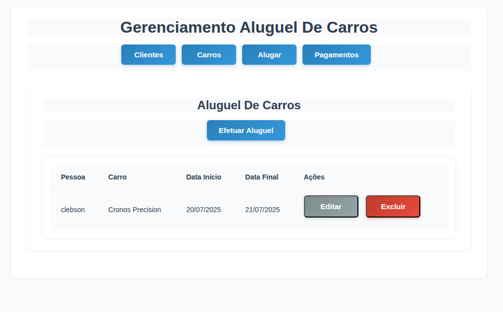
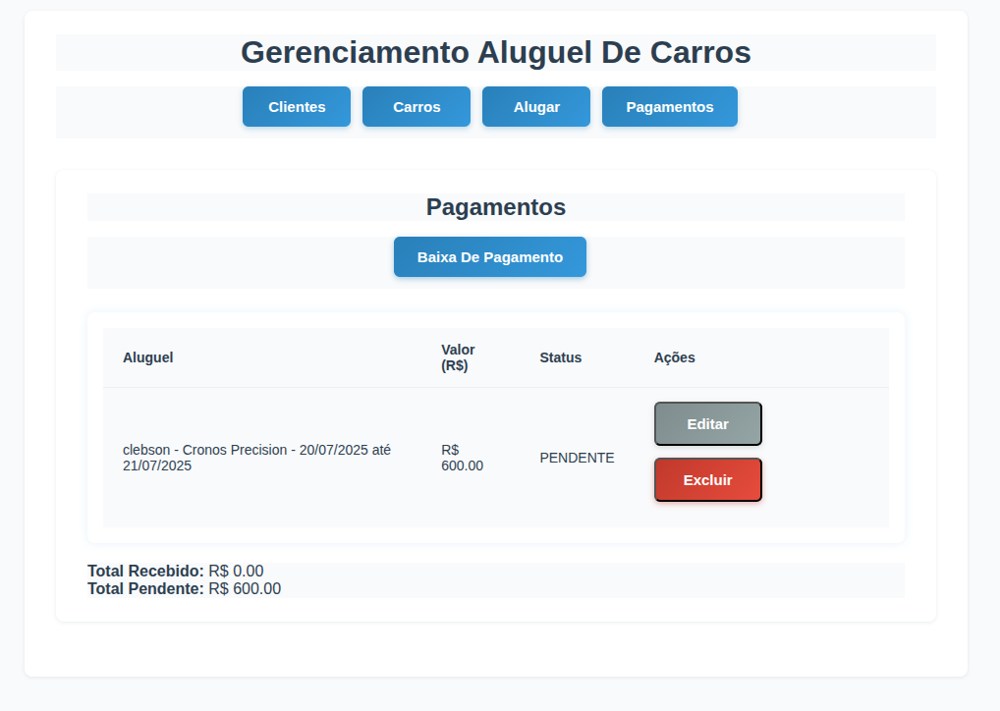
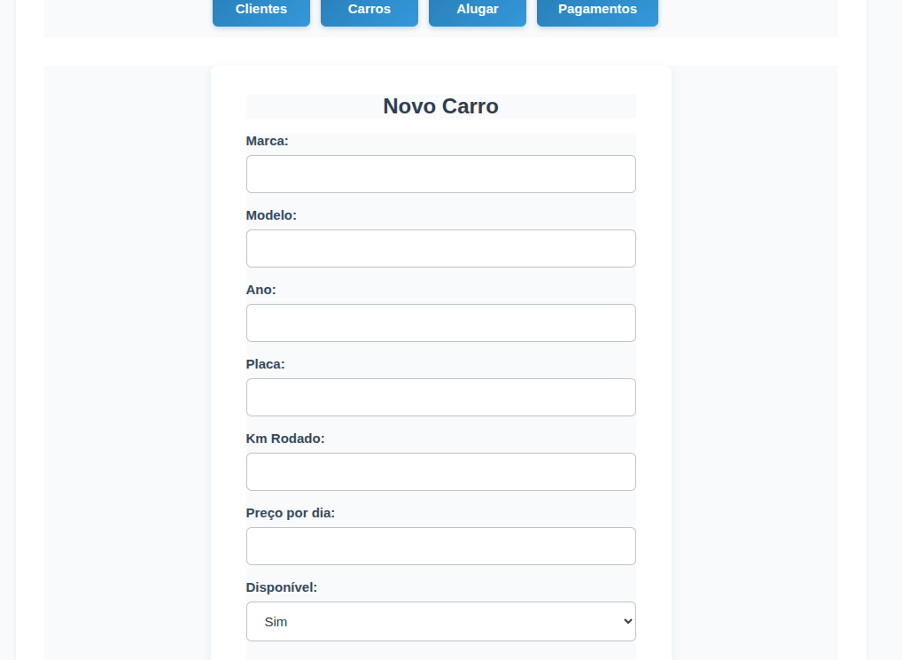
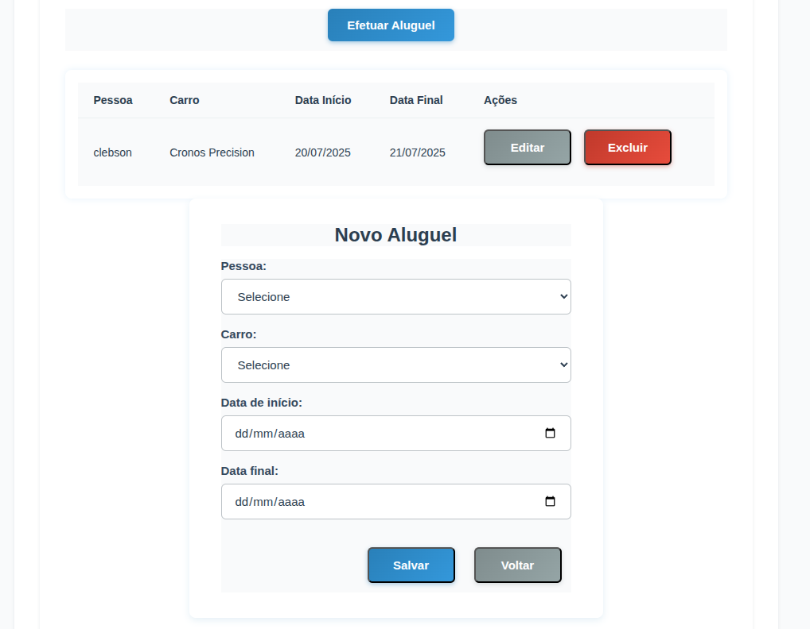

# Sistema de Aluguel de Carros React + TypeScript + Vite + LocalStorage

Bem-vindo ao projeto!

## 🚗 Funcionalidades
- Cadastro De Clientes
- Editar Clientes
- Remover Clientes
- Cadastro de carros
- Editar Carros
- Remover Carros
- Efetuar Aluguel De Um Carro
- Editar Aluguel Do Veiculo
- Controle De Pagamentos Pagos/Pendentes

## 🖼️ Telas Do Sistema

